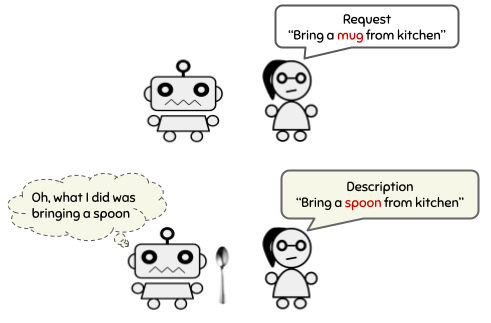

# Interactive Learning from Activity Description (ILIAD)


Implementation of experiments in [Interactive Learning from Description](https://arxiv.org/pdf/2102.07024.pdf) (ICML 2021).

ILIAD is a interactive learning framework that enables training agents using only **language description feedback**.



### Clone the repo

- Please use the `-recursive` flag when cloning: `git clone --recursive https://github.com/khanhptnk/iliad.git`

### Download Data

- Download and extract data: `cd data && bash download.sh`

### Setup Docker

- Install [Docker and Nvidia Container Toolkit](https://docs.nvidia.com/datacenter/cloud-native/container-toolkit/install-guide.html#docker)

- `cd code`

- Build Docker image: `bash scripts/build_docker.sh` (use `sudo` if needed)

- Run Docker image: `bash scripts/run_docker.sh`

- Build the Matterport3D simulator inside the image:

```
# cd iliad/code
# bash scripts/build_simulator.sh
```

### Run experiments

**All commands must be run inside the Docker image!**

- Go to the NAV directory: `cd tasks/$TASK` where `$TASK` is either `NAV` or `REGEX`.

- Train a baseline as: `bash scripts/train_$BASELINE` where `$BASELINE` is one of `dagger`, `rl_bin`, `rl_cont`.

- Train an ILIAD/ADEL agent:

  1) Train the teacher's execution policy: `bash scripts/train_executor.sh`
  2) Train the teacher's describer: `bash scripts/train_describer.sh`
  3) `REGEX` only! initialize the student with unlabeled executions: `bash scripts/pretrain_iliad.sh`
  4) Train the student's with ILIAD/ADEL: `bash scripts/train_iliad.sh`

### Citation

```
@inproceedings{nguyen2021iliad,
  title={Interactive Learning from Activity Description},
  author={Nguyen, Khanh and Misra, Dipendra and Schapire, Robert and Dud{\'\i}k, Miro and Shafto, Patrick},
  booktitle={Proceedings of the 38th International Conference on Machine Learning},
  year={2021},
  url={https://arxiv.org/pdf/2102.07024.pdf}
}
```

