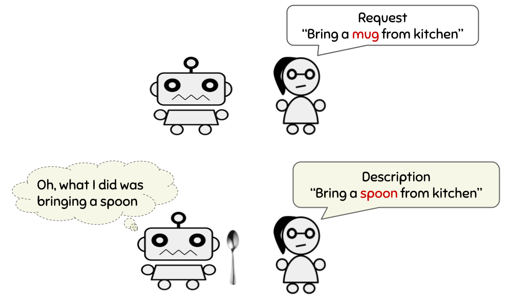

# Interactive Learning from Activity Description (ILIAD)


Implementation of experiments in [Interactive Learning from Activity Description](https://arxiv.org/pdf/2102.07024.pdf) (ICML 2021).

ILIAD is an interactive learning framework that enables training agents using only **language description feedback**.



### Clone Repo

- Please use the `-recursive` flag when cloning: `git clone --recursive https://github.com/khanhptnk/iliad.git`

### Download Data

- Download and extract data: `cd data && bash download_data.sh` (3.1GB)

### Setup Docker

- Install [Docker and Nvidia Container Toolkit](https://docs.nvidia.com/datacenter/cloud-native/container-toolkit/install-guide.html#docker)

- `cd code`

- Build Docker image: `bash scripts/build_docker.sh` (use `sudo` if needed)

- Run Docker image: `bash scripts/run_docker.sh`. If you successfully launch the image, the terminal prompt will end with `#` instead of `$`.

- **Inside the image**, build the Matterport3D simulator:

```
# cd iliad/code
# bash scripts/build_simulator.sh
```

and create `experiments` directories:

```
# mkdir tasks/NAV/experiments
# mkdir tasks/REGEX/experiments
```


### Run Experiments

**All commands in this section must be run inside the Docker image! (where the prompt starts with `#`)**

- Go to the NAV directory: `cd iliad/code/tasks/$TASK` where `$TASK` is either `NAV` or `REGEX`.

- Train a baseline as: `bash scripts/train_$BASELINE.sh` where `$BASELINE` is one of `dagger`, `reinforce_binary`, `reinforce_continuous`.

- Train an ILIAD/ADEL agent:

  1) Train the teacher's execution policy: `bash scripts/train_executor.sh`
  2) Train the teacher's describer: `bash scripts/train_describer.sh`
  3) `REGEX` only! initialize the student with unlabeled executions: `bash scripts/pretrain_iliad.sh`
  4) Train the student's with ILIAD/ADEL: `bash scripts/train_iliad.sh`

- For each experiment, a log file will be saved to `experiments/$NAME/run.log` where `$NAME` is the name of the experiment specified in the YAML config file of the experiment (these config files are in the `configs` folder; you can view an experiment's .sh script to see what config file it is using).

- Evaluate an agent: `bash scripts/eval.sh $METHOD` where `$METHOD` is one of `iliad`, `dagger`, `reinforce_binary`, `reinforce_continuous`.

### Citation

```
@inproceedings{nguyen2021iliad,
  title={Interactive Learning from Activity Description},
  author={Nguyen, Khanh and Misra, Dipendra and Schapire, Robert and Dud{\'\i}k, Miro and Shafto, Patrick},
  booktitle={Proceedings of the 38th International Conference on Machine Learning},
  year={2021},
  url={https://arxiv.org/pdf/2102.07024.pdf}
}
```

### Contact

If you have questions, please contact Khanh at kxnguyen@umd.edu or nguyenxuankhanhm@gmail.com.

